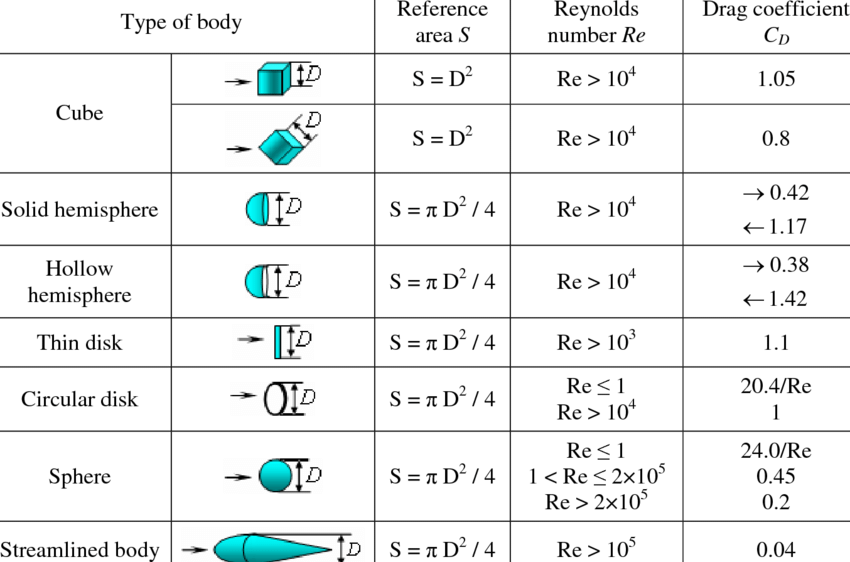
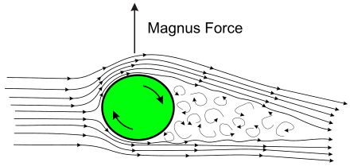
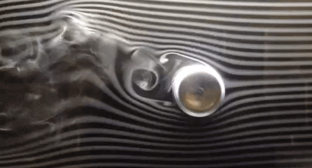

# Projectiles

## Intro

In FRC, robots are often tasked with launching projectiles. Understanding how a projectile travels through air is key to designing mechanisms known as "shooters."

## Concepts

[Vacuum](#vacuum)\
[Drag](#drag)\
[Magnus Effect](#magnus-effect)\
[Precession](#precession)\
[Nutation](#nutation)

### Vacuum

**Relevance:** Objects moving at low speeds can often be approximated by ignoring drag which may be favorable as computing drag is complex.

In a vacuum, gravity is the only force acting on the projectile, although the projectile may have some initial horizontal and vertical velocities.

Net force equations:
$$F_x=0$$
$$F_y=-g$$

The net force equations can be converted into equations of motion by integrating with respect to time twice to yield the parametric equations:

$$x=v_{x0}t+x_0$$
$$y=-\frac{1}{2}gt^2+v_{y0}t+y_0$$

In words, the horizontal displacement is equal to the initial horizontal velocity multiplied by time and added to the initial horizontal displacement. At the same time, the vertical displacement is equal to the negative acceleration of gravity divided by 2 multiplied by time squared and summed with the velocity term, the product of the initial vertical velocity and time, and the displacement term, the initial vertical displacement.

These equations are for the forward calculation of projectile motion in a vacuum. The reverse calculation is often needed and is described below. The reverse calculation takes the ending point and calculates suggested launch velocities.

**Reverse Calculation:**

To calculate the reverse calculation we need to know what we know. We know the ending position and angle that we want the ball to approach the target at but we do not know the starting velocity.

Since we know the ending angle, we can derive a relation by forcing our equations of motion to have a certain ending angle/slope.

Assuming that the projectile launches from the origin:
$$x=v_{x0}t$$
$$y=-\frac{1}{2}gt^2+v_{y0}t$$

The x equation can be solved for t and substituted into the y equation to yield the equation of motion in terms of x and y.
$$t=\frac{x}{v_{x0}}$$
$$y=\frac{-g}{2}(\frac{x}{v_{x0}})^2+v_{y0}(\frac{x}{v_{x0}})$$

In standard form:
$$y=\frac{-g}{2v_{x0}^2}x^2+\frac{v_{y0}}{v_{x0}}x$$

Taking the derivative with respect to x:
$$y'=\frac{-g}{v_{x0}^2}x+\frac{v_{y0}}{v_{x0}}$$

Let *l* equal the distance to the target and *h* the height of the target.

From our constraint:
$$y'|_{x=l}=tan(\theta_f)$$

In words this is y', the slope of the equation of motion, evaluated when x equals _l_ is equal to the tangent of the ending angle.
$$y'|_{x=l}=\frac{-g}{v_{x0}^2}l+\frac{v_{y0}}{v_{x0}}=tan(\theta_f)$$

Solving for $v_{y0}$ as if $v_{x0}$ will provide us a starting point to finding $v_{y0}$. Next, we would only need to find $v_{x0}$ in terms of known constants.
$$v_{y0}=tan(\theta_f)v_{x0}+\frac{gl}{v_{x0}}$$

Using the ending position we can write a constraint formula as:
$$y(l)=h$$
$$y(l)=\frac{-g}{2v_{x0}^2}l^2+\frac{v_{y0}}{v_{x0}}l=h$$

Now we can eliminate $v_{y0}$.
$$\frac{-gl^2}{2v_{x0}^2}+\frac{tan(\theta_f)v_{x0}+\frac{gl}{v_{x0}}}{v_{x0}}l=h$$

Solving for $v_{x0}$ gives:
$$v_{x0}=\sqrt{\frac{gl^2/2}{h-tan(\theta_f)l}}$$

And thus, we can substitute this into the $v_{y0}$ formula to yield an expression only in terms of knowns. We have successfully reversed our projectile motion equation!

<iframe src="https://www.desmos.com/calculator/kgdelj6trd?embed" width="500" height="500" style="border: 1px solid #ccc" frameborder=0></iframe>

### Drag

**Relevance:** Drag can have a noticeable effect on the motion of projectiles altering launching distance and time.

Drag is an approximation of a very complex phenomenon. It is often simplified to two forms:

Linear drag: $F_D=kv$

Quadratic drag: $F_D=kv^2$

_k_ is basically a fudge factor that needs to be determined experimentally or found using the formula $\frac{1}{2}\rho C_DA$ where $\rho$ is the density of air, $C_D$ is a number representing the "complex dependencies" which can be found using a table and referencing the shape of the projectile, and A is the reference/often cross-sectional area.

The density of air: 1.225 kg/m^3

CD:

Linear drag has a closed form for its equations of motion while quadratic drag does not and must be found using numerical approximations like Euler's method.

More information on linear drag can be found here:\
<https://farside.ph.utexas.edu/teaching/336k/lectures/node29.html>

### Magnus Effect

**Relevance:** A projectile spinning in the air can alter its trajectory.

Since I do not understand the math, this section will only provide how I understand the effect intuitively rather than correctly.

| Spin     | Trajectory |
| -------- | ---------- |
| forward  | downward   |
| backward | upward     |
| ccw      | leftward   |
| cw       | rightward  |

Some reference images:

My shortcut yet likely flawed way to remembering the direction of the effect:

Behind the projectile is a turbulent region of air. This region of air is "harder" than the surrounding air as in the turbulent air is harder for the projectile to cut through. Thus, the motion of the surface of the projectile near the rear of the projectile is what determines its trajectory. In a backspin situation, the rear surface of the projectile is moving downward which thorough air friction causes a response force with moves the projectile upward.

### Precession

**Relevance:** When a torque acts perpendicular to the axis of rotation, the body will start to orbit around that axis. When this orbiting becomes too extreme, the rotating body becomes unstable which may be undesirable for projectiles.

This phenomenon is reflected by the wobble of spinning tops.

From an intermediate step in the above derivation:

$$\omega_p=\frac{\tau}{L\sin(\phi)}$$

In projectile motion, the torque used in the formula can be a result of drag or gravity depending on the orientation of the axis of rotation in respect to the earth.

For a frisbee, the axis of rotation is likely pointing upwards which means that the torque due to gravity is used in the formula.

For a football, the axis of rotation is likely pointing (approximately) horizontally so the torque used in the formula would be caused by drag.

For a ball with forward or backspin, the effect of precession is limited unless the ball is expected to experience lateral forces during its motion.

The above formula can be rewritten is a form more useful for our purposes:

$$\omega_p=\frac{Fr}{I\omega}$$

This formula tells us that the precessional velocity decreases when the moment of inertia of the projectile increases or when the angular velocity of the projectile increases.

### Nutation

**Relevance:** Nutation is another factor that plays into the motion of a projectile. Although, like the Magnus effect and quadratic drag, I am unsure how this would factor into the calculations.

When a spinning projectile experiences a force parallel to the plane drawn out by the angular momentum vector, nutation takes effect by changing the tilt angle. Nutation is the warping of the circular path caused by precession. Instead of a football wobbling in a circle, the football would wobble in a more elliptical like path.

Continuing our examples from the previous section:

For a frisbee, nutation would be caused by drag.

For a football, by gravity.

For a ball with forward/backspin and experiencing precession, nutation would be caused by both drag and gravity.