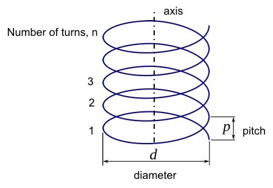
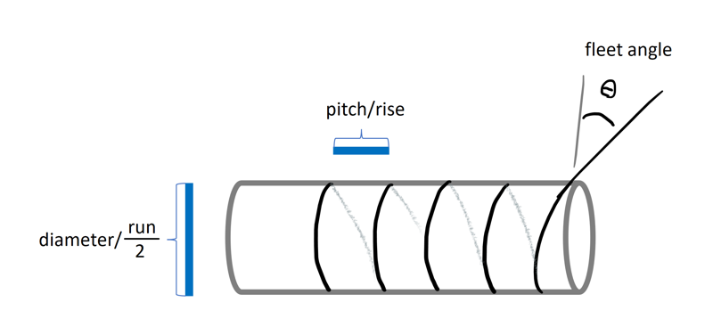

# Ropes

## Concepts

[Tension](#tension)\
[Capstan Equation](#capstan-equation)\
[Fleet Angle](#fleet-angle)

### Tension

**Relevance:** In FRC, ropes are commonly used to lift an elevator, help a robot climb, or carry an alliance robot.

Tension is a force associated with stretching things. To determine if a rope is strong enough to lift something, the tensile strength of the rope will need to be examined.

At Torque, we often use Dyneema rope which is comparable to Spectra cord both of which are stronger than steel.

7x7 Strand Stainless Steel Cable Tensile Strength

| Diameter (in) | Tensile Strength (lbf) |
| ------------- | ---------------------- |
| 3/64          | 270                    |
| 1/16          | 480                    |
| 3/32          | 920                    |
| 1/8           | 1700                   |
| 5/32          | 2400                   |
| 3/16          | 3700                   |
| 1/4           | 6100                   |

12 Strand Spectra Tensile Strength

| Diameter (in) | Tensile Strength (lbf) |
| ------------- | ---------------------- |
| 1/8           | 1800                   |
| 3/16          | 3600                   |
| 1/4           | 6000                   |

$$\text{Tensile Strength}=F_{tu}$$

**EX:** What is the maximum mass that can be hung off of a 1/16 in diameter 7x7 steel cable?
$$F_{tu}=F_g$$
$$480\text{ lbf}=mg$$
$$m=480\text{ lb}$$

Note: lbf is a measure of force while lb is a measure of mass.

Despite the tensile impressive strength of the fiber, it is susceptible to stretching and thus methods to tension the string over repeated use should be considered.

### Capstan Equation

**Relevance:** The Euler-Eytelwein Equation aka. the Capstan Equation relates the tension of two sides of a rope wrapped around a tube. This had potential uses in Steamworks when robots needed to climb a rope and has uses on elevators and winches.

Its derivation is quite elegant and can be found here: <https://www.youtube.com/watch?v=hsbNusf2N8Y>

The formula is:

$$T_{load}=T_{in}e^{\mu \theta}$$

where *T* is tension, $\mu$ is the coefficient of friction, and $\theta$ is how much the rope is wrapped around the pipe in radians.

The number of wraps **exponentially** increases the amount of load an input force can hold.

### Fleet Angle

**Relevance:** The angle at which a rope is spooled can affect the evenness of the wrapping. Uneven wrapping is more likely to tangle and is unpredictable.

To understand how a rope will wrap around a pipe, this section will take a kinematic approach rather than a dynamic one as the differential equations become unwieldy.

Let us start off with the parametric equation of a circle as we know that the pipe has a circular shape of radius _r_.

Let us start off with the parametric equation of a circle as we know that the pipe has a circular shape of radius *r*.
$$x=rcos(t),y=rsin(t)$$

As a vector, this is:
$$<rcos(t),rsin(t)>$$

To bring our rope into 3D space, we need to define the z component which for now we can define as some function *z(t)*. Let us call our postion function *R(t)*.

$$R(t)=<rcos(t),rsin(t),z(t)>$$

\*_Let: z(t)=t_

From geometry, we know that there are 360 degrees or 2$\pi$ radians in a circle. Thus, on the interval $t=[0, 2\pi)$ *R(t)* makes one full circle. If $z(t)=t,$ then the rope will travel $2\pi$ units per wrap which is known as pitch *p*.

$$p=2\pi\frac{z(t)}{t}$$

So far, we have a helix but we still need to find a relation between _R(t)_ and the fleet angle.

Using trigonometry, we can write:
$$\tan\theta=\frac{pitch}{2*diameter}$$

Note: the "" 2 "" is because the rope spans one diameter on the front side plus an additional diameter on the backside.

Solving for *pitch*:

$$p=\tan(\theta)(2*diameter)$$
$$p=4r\tan(\theta)$$

From before:
$$p=2\pi\frac{z(t)}{t}$$
$$z(t)=\frac{p}{2\pi}t$$
$$z(t)=\frac{4r\tan(\theta)}{2\pi}t$$
$$z(t)=\frac{2r\tan(\theta)}{\pi}t$$
$$R(t)=<rcos(t),rsin(t),z(t)>$$
$$R(t)=<rcos(t),rsin(t),\frac{2r\tan(\theta)}{\pi}t>$$

Note: Theta can be a function of t.

<iframe src="https://www.geogebra.org/3d/x2rvhnrq?embed" width="70%" height="750" allowfullscreen style="border: 1px solid #ccc" frameborder=0></iframe>

Note: Use the scroll wheel and left mouse button to navigate. Press the house shaped home button if the graph gets lost. Try altering $\theta(t)$